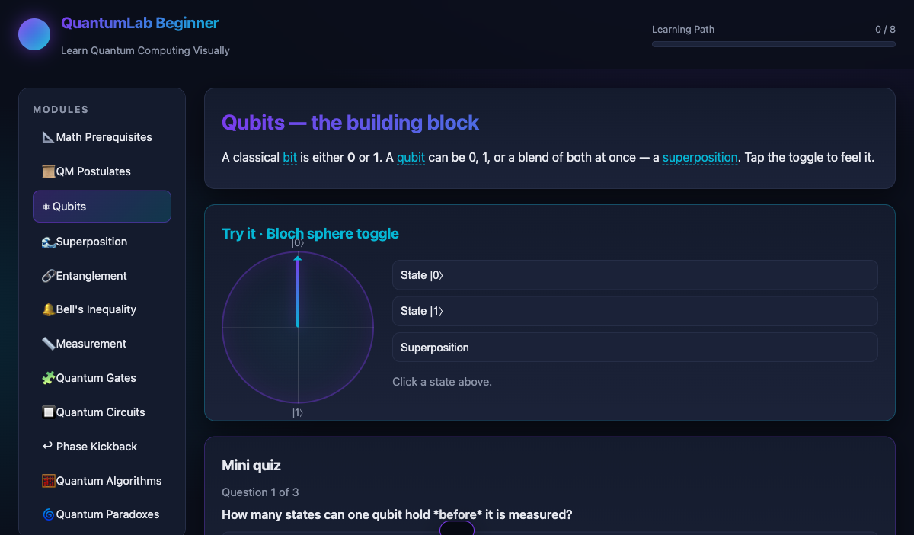

<div align="center">

# QuantumLab Beginner

[](https://developer.mozilla.org/docs/Web/HTML)
[](https://developer.mozilla.org/docs/Web/CSS)
[](https://developer.mozilla.org/docs/Web/JavaScript)
[](#)
[](LICENSE)
[](https://alfredang.github.io/quantumlabs/)

**Learn Quantum Computing Visually — interactive lessons, simulators, paradoxes &amp; algorithms in your browser.**

[Live Demo](https://alfredang.github.io/quantumlabs/) · [Report Bug](https://github.com/alfredang/quantumlabs/issues) · [Request Feature](https://github.com/alfredang/quantumlabs/issues)

</div>

## Screenshot



## About

**QuantumLab Beginner** is a self-contained, frontend-only web app for learning quantum
computing through small, interactive demos. Each concept gets its own visual playground —
sliders, drag-and-drop circuit builders, live state-vector readouts, paradox simulators —
so you can build intuition before tackling the math.

The whole app runs in the browser. No backend, no database, no external APIs. Progress
persists in `localStorage`.

### Key Features

- **18 modules** covering the foundations through advanced topics — from math &amp; postulates
  to algorithms, paradoxes, cryptography, and error correction.
- **Interactive simulators** for every topic: Bloch-disc qubit toggle, probability slider with
  live Dirac notation, Bell-pair entanglement, CHSH inequality test, drag-and-drop multi-qubit
  circuit builder with full gate set, phase-kickback explorer, BB84 key distribution,
  3-qubit error-correction Monte-Carlo, channel-noise propagation.
- **Quantum algorithms** with circuit diagrams: Coin Flip, Grover, Deutsch–Jozsa,
  Teleportation, QFT, Shor's factoring.
- **Quantum paradoxes** with experiment-setup SVG diagrams: Schrödinger's Cat,
  Wigner's Friend, Frauchiger–Renner, Quantum Eraser, Delayed-Choice Eraser, Quantum Zeno.
- **Per-module quiz** with score tracking, progress bar, badges, and a final challenge
  unlocked at 6/8 modules done.
- **LaTeX-style typography** for Dirac notation, fractions, matrices, and operator equations.
- **Dark futuristic UI** that's responsive down to mobile.

## Tech Stack

| Category   | Tech                                                            |
|------------|-----------------------------------------------------------------|
| Markup     | HTML5                                                           |
| Styling    | CSS3 (CSS variables, grid, flex, keyframe animations)           |
| Logic      | Vanilla JavaScript (ES2020, single IIFE, no build step)         |
| Math font  | STIX Two Math / Cambria Math / Times New Roman fallback         |
| Storage    | `localStorage` (progress, scores, badges)                       |
| Diagrams   | Inline SVG, HTML5 Canvas (charts &amp; animations)              |
| Deployment | GitHub Pages via GitHub Actions                                 |

**Zero dependencies.** No frameworks, no bundlers, no CDNs.

## Architecture

```
┌──────────────────────────────────────────────────────────────────────┐
│                            Browser (only)                            │
├──────────────────────────────────────────────────────────────────────┤
│                                                                      │
│   ┌─────────────┐   ┌────────────────────┐   ┌─────────────────┐     │
│   │  index.html │   │     style.css      │   │    script.js    │     │
│   │  (SPA shell)│   │  (dark theme + UI) │   │ (all logic IIFE)│     │
│   └─────────────┘   └────────────────────┘   └─────────────────┘     │
│           │                    │                       │             │
│           └──── hash router ───┴── module sections ────┘             │
│                                    │                                 │
│             ┌──────────────────────┴──────────────────┐              │
│             │                                         │              │
│        ┌────▼────┐    ┌──────────┐    ┌─────────┐ ┌───▼────┐         │
│        │ widgets │    │ quizzes  │    │ paradox │ │  state │         │
│        │ (Bloch, │    │ (3 MCQs/ │    │ sims    │ │  + 2ⁿ  │         │
│        │ canvas, │    │  module) │    │ (canvas │ │  vec   │         │
│        │ DnD,    │    │          │    │  + SVG) │ │  sim)  │         │
│        │ sliders)│    │          │    │         │ │        │         │
│        └─────────┘    └──────────┘    └─────────┘ └────────┘         │
│                                                                      │
│                       ┌────────────────────┐                         │
│                       │   localStorage     │                         │
│                       │  quantumlab.       │                         │
│                       │  progress.v1       │                         │
│                       └────────────────────┘                         │
└──────────────────────────────────────────────────────────────────────┘
```

## Project Structure

```
quantumlabs/
├── index.html          # SPA shell — sidebar nav + 18 module sections
├── style.css           # Dark futuristic theme, responsive layout, animations
├── script.js           # All logic — router, simulators, quiz engine, persistence
├── screenshot.png      # README screenshot
└── README.md           # This file
```

All UI, math, and simulation lives in `script.js` as a single IIFE:

| Section in `script.js`           | What it does                                                  |
|----------------------------------|---------------------------------------------------------------|
| `MODULES`, `QUIZ_DATA`, `GLOSSARY`, `FAQ` | Static content (8 quizzed modules + reference)       |
| `initQubits`, `initSuperposition`, … | One init per module — wires up sliders, buttons, canvases |
| `initCircuits`                   | Drag &amp; drop circuit builder + full 2ⁿ state-vector simulator with X/Y/Z/H/S/T/Rx/Ry/Rz/CNOT/CZ/Barrier/Measure |
| `initBell`                       | CHSH Monte Carlo (quantum vs hidden-variable)                 |
| `initKickback`                   | 4-state phase-kickback explorer                               |
| `initParadox`                    | Six paradoxes (Cat / Wigner / FR / Eraser / Delayed / Zeno)   |
| `initCrypto`                     | BB84 protocol with optional Eve eavesdropper                  |
| `initQEC`                        | 3-qubit bit-flip code + bare-vs-coded comparison              |
| `renderMiniCircuit`              | Mini circuit diagram renderer (used by every algorithm tab)   |
| `renderQuiz`                     | Generic 3-question MCQ engine with feedback                   |

## Getting Started

### Prerequisites

A modern browser (Chrome, Firefox, Safari, Edge). Nothing else.

### Run locally

```bash
git clone https://github.com/alfredang/quantumlabs.git
cd quantumlabs

# Either open index.html directly, or serve over HTTP:
python3 -m http.server 8000
# then visit http://localhost:8000
```

That's it. There is no install step.

## Deployment

### GitHub Pages

A GitHub Actions workflow auto-deploys `main` to GitHub Pages.
The live site is at: **https://alfredang.github.io/quantumlabs/**

To deploy your own fork:
1. Fork this repo.
2. Settings → Pages → Source: **GitHub Actions**.
3. Push to `main` — the workflow at `.github/workflows/deploy.yml` builds and publishes.

### Anywhere else (it's just static files)

Drop the three files (`index.html`, `style.css`, `script.js`) onto any static host:
Netlify, Vercel, S3, Cloudflare Pages, your own nginx — anywhere that serves files.

## Modules at a glance

| #  | Module              | Type        | Highlights                                   |
|----|---------------------|-------------|----------------------------------------------|
| —  | Math Prerequisites  | Reference   | Vectors, complex numbers, Hermitian, unitary |
| —  | QM Postulates       | Reference   | The five postulates with formulas            |
| 1  | Qubits              | Quizzed     | Bloch-disc 0/1/superposition toggle          |
| 2  | Superposition       | Quizzed     | Probability slider + live Dirac panel        |
| 3  | Entanglement        | Quizzed     | Bell pair + animated state-vector readout    |
| —  | Bell's Inequality   | Demo        | CHSH meter — 2 vs 2√2 bound                  |
| 4  | Measurement         | Quizzed     | Repeated measurement chart + Dirac panel     |
| —  | Quantum Gates       | Reference   | Gate library: matrix · effect · explanation  |
| 5  | Quantum Circuits    | Quizzed     | Drag &amp; drop builder, 2ⁿ simulator        |
| —  | Phase Kickback      | Demo        | Compare 4 target states → kickback           |
| 6  | Quantum Algorithms  | Quizzed     | Coin / Grover / DJ / Teleport / QFT / Shor   |
| —  | Quantum Paradoxes   | Demo        | 6 paradoxes with experiment SVGs             |
| —  | Quantum Cryptography| Demo        | BB84 protocol with Eve toggle                |
| 7  | Noise               | Quizzed     | Multi-step bit-flip channel                  |
| 8  | QEC                 | Quizzed     | 3-qubit bit-flip code + Monte Carlo          |

## Contributing

Contributions are welcome — file a bug, suggest a new module, or open a pull request.

1. Fork the repo
2. Create a feature branch: `git checkout -b feat/my-thing`
3. Commit your changes
4. Push and open a PR

## Developed By

**Tertiary Infotech Academy Pte Ltd**
[https://www.tertiarycourses.com.sg/](https://www.tertiarycourses.com.sg/)

## Acknowledgements

- Inspired by Q-CTRL Black Opal, IBM Quantum Composer, and Microsoft Quantum Katas.
- Math typography uses STIX Two Math / Cambria Math fallbacks (no MathJax/KaTeX).
- All quantum simulations are hand-rolled in vanilla JS at a beginner-appropriate fidelity.

---

If you find this useful, please ⭐ the repo!
